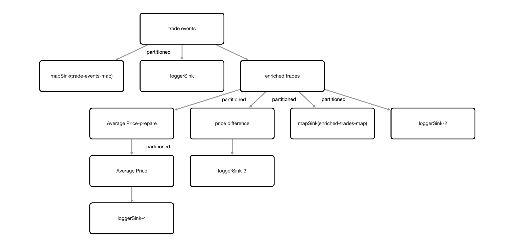

# TradeStream Project Description

Project consists of Hazelcast cluster, a trade generator client and a TradeStream pipeline job.

The trade generator client creates SQL mappings for IMaps, loads reference data into lookup-map, and sends 
fake trades (tradeId, tradeTime, symbol, quantity, price) on an infinite loop into trade-map. 
An IMap Journal is configured on the trades-map which creates a trade event stream.

The TradeStream Pipeline job listens to the trade event stream and does a number of actions on the trade event stream:

- Writes to console to show have received raw trade values
- Writes to trade-events-map to show map listeners still work in pipeline. Map listener outputs every trade entry to console
- Enriches the trade data with the company name for that trade symbol
- Writes enriched trades to console
- Writes enriched trades to enriched-trades-map
- Stateful processing to report if a price drops by more than 200
- Writes price drop to console
- Group the events by symbol. For each symbol, compute the average price over a 10s
  tumbling window.


  
### To compile:
`mvn install`

### Start Hazelcast
To start hazelcast with map journals on trades imap, and start management centre, run:
```shell
docker compose up -d
docker compose ps
docker compose logs --follow hz
```
Look at management center, http://localhost:8080

### Submit TradeStream pipeline job:
To compile (if not already compiled from initial mvn install):
```shell
cd monitoring-pipeline
mvn package
```

To submit job:
```shell
cd monitoring-pipeline
hz-cli submit --class demos.pipelines.TradeStream target/monitoring-pipeline-1.0-SNAPSHOT.jar
```

### Run trade generator

```shell
cd trade-generator
java -jar target/trade-generator-1.0-SNAPSHOT.jar
```


